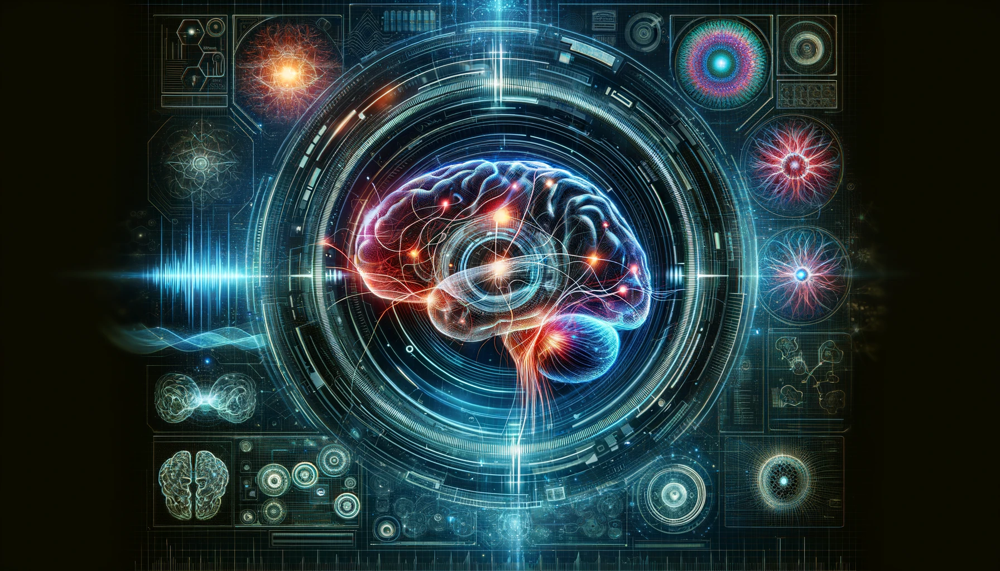

# Neuroscience

### Introduction to Computational Neuroscience

Computational Neuroscience is the study of brain function in terms of the information processing properties of the structures that make up the nervous system. It uses mathematical models and theoretical analysis to understand how the brain processes information.

### Neural Encoding

Neural Encoding involves understanding how sensory and other information is represented in the brain by the firing of neurons. This includes studying the firing rates, spike timing, and neural code.

### Neural Decoding

Neural Decoding is the process of interpreting the patterns of neural activity to understand the information being processed by the brain. It involves translating neural signals back into sensory information or motor commands.

### Artificial Neural Networks

Artificial Neural Networks (ANNs) are computing systems inspired by the biological neural networks that constitute animal brains. They are used in machine learning and artificial intelligence to model complex patterns and predictions.

### Spiking Neural Networks

Spiking Neural Networks (SNNs) are a type of artificial neural network that more closely mimics the natural neural networks in the brain. SNNs use spikes or action potentials to process information.

### Hebbian Learning

Hebbian Learning is a theory in neuroscience that proposes an explanation for the adaptation of neurons in the brain during the learning process. It is often summarized as 'cells that fire together, wire together.'

### Spike-Timing-Dependent Plasticity

Spike-Timing-Dependent Plasticity (STDP) is a biological process that adjusts the strength of connections between neurons in the brain based on the relative timing of a particular neuron's output and input action potentials (spikes).

### Hodgkin-Huxley Model

The Hodgkin-Huxley Model is a mathematical model that describes how action potentials in neurons are initiated and propagated. It is based on the dynamics of ion channels in the neuronal membrane.

### Integrate-and-Fire Models

Integrate-and-Fire Models are a simplified representation of neuronal activity where the neuron integrates incoming signals until a threshold is reached, triggering a spike or action potential.

### FitzHugh-Nagumo Model

The FitzHugh-Nagumo Model is a simplification of the Hodgkin-Huxley Model that describes the excitability of neurons using two differential equations, capturing the basic mechanism of excitability and action potential generation.

### Izhikevich Model

The Izhikevich Model is a computational model that combines the biologically plausible dynamics of the Hodgkin-Huxley model with the computational efficiency of the integrate-and-fire model.

### Oscillatory Dynamics

Oscillatory Dynamics in neural networks refer to the rhythmic or repetitive neural activity in the brain. These oscillations are thought to play a key role in cognitive functions such as perception, attention, and memory.

### Small-World Networks

Small-World Networks are a type of graph structure where most nodes are not neighbors but can be reached from every other by a small number of steps. This concept is used to describe the efficient connectivity of neural networks in the brain.

### Scale-Free Networks

Scale-Free Networks are characterized by the presence of a few highly connected nodes (hubs) and many nodes with fewer connections. These networks are used to describe the connectivity pattern of neurons in the brain.

### Neuronal Models

Neuronal Models are computational representations of individual neurons and their electrical behavior. Examples include the Hodgkin-Huxley model, the FitzHugh-Nagumo model, and the Izhikevich model.

### Synaptic Models

Synaptic Models describe the dynamics of synaptic transmission, including the release of neurotransmitters and the resulting post-synaptic potentials. They are essential for understanding neural communication and plasticity.

### Network Models

Network Models represent interconnected neurons and their collective dynamics. These models are used to study how neural circuits process information and generate behaviors.

### Long-Term Potentiation

Long-Term Potentiation (LTP) is a long-lasting increase in synaptic strength following high-frequency stimulation of a synapse. It is one of the primary mechanisms underlying learning and memory.

### Long-Term Depression

Long-Term Depression (LTD) is a long-lasting decrease in synaptic strength following low-frequency stimulation of a synapse. It serves as a counterbalance to LTP and is also involved in learning and memory.

### Reinforcement Learning

Reinforcement Learning is a type of machine learning inspired by behavioral psychology, where an agent learns to make decisions by receiving rewards or punishments. It is used to model learning in neural systems.

### Visual System

The Visual System in computational neuroscience involves modeling the processing of visual information from the retina to the visual cortex. It includes studies on edge detection, motion detection, and object recognition.

### Auditory System

The Auditory System involves modeling how sound information is processed from the cochlea to the auditory cortex. It includes studies on sound localization, pitch perception, and speech recognition.

### Somatosensory System

The Somatosensory System involves modeling how tactile information is processed from the skin to the somatosensory cortex. It includes studies on touch, proprioception, and pain perception.

### Motor Control

Motor Control involves modeling how the brain plans, initiates, and executes movements. It includes studies on the motor cortex, basal ganglia, and cerebellum, as well as the principles of motor learning and coordination.

### Brain-Machine Interfaces

Brain-Machine Interfaces (BMIs) involve creating direct communication pathways between the brain and external devices. They are used to restore movement in individuals with motor impairments and to study motor control.

### Attention

Attention in computational neuroscience involves modeling how the brain selects and focuses on relevant information. It includes studies on neural mechanisms of attention and the impact of attention on perception and action.

### Memory

Memory involves modeling how information is encoded, stored, and retrieved in the brain. It includes studies on different types of memory, such as working memory, episodic memory, and procedural memory.

### Decision Making

Decision Making involves modeling the neural processes underlying the selection of actions based on sensory input and internal states. It includes studies on the prefrontal cortex, reward systems, and cognitive strategies.

### Language Processing

Language Processing involves modeling how the brain processes and produces language. It includes studies on speech perception, syntactic processing, and semantic understanding.

### Emotion

Emotion involves modeling the neural mechanisms underlying emotional responses. It includes studies on the limbic system, the impact of emotions on cognition and behavior, and computational models of emotional processing.

### Neurodegenerative Diseases

Neurodegenerative Diseases involve modeling the progression and impact of diseases like Alzheimer's, Parkinson's, and ALS. These models are used to understand disease mechanisms and develop potential treatments.

### Psychiatric Disorders

Psychiatric Disorders involve modeling the neural basis of conditions like depression, schizophrenia, and bipolar disorder. These models aim to understand the underlying neural circuits and develop therapeutic interventions.

### Epilepsy

Epilepsy involves modeling the neural mechanisms of seizure generation and propagation. These models are used to study the dynamics of epileptic networks and to develop seizure prediction and control strategies.

### Electrophysiological Recording

Electrophysiological Recording involves measuring electrical activity in the brain using techniques like EEG, MEG, and single-unit recordings. These techniques are used to study neural dynamics and brain function.

### Neuroimaging

Neuroimaging involves creating visual representations of the brain using techniques like MRI, fMRI, and PET. These techniques are used to study brain structure, function, and connectivity.

### Computational Modeling

Computational Modeling involves creating mathematical models to simulate neural systems and processes. These models are used to test hypotheses, predict neural behavior, and understand brain function.

### Data Analysis Methods

Data Analysis Methods involve techniques for processing and analyzing neural data. This includes signal processing, statistical analysis, machine learning, and data visualization.

### Neural Prosthetics

Neural Prosthetics involve developing devices that replace or augment neural functions. These applications include cochlear implants, retinal implants, and brain-machine interfaces.

### Neuroinformatics

Neuroinformatics involves managing and analyzing large-scale neuroscience data. It includes the development of databases, tools for data sharing, and computational frameworks for data integration.

### Neuromorphic Engineering

Neuromorphic Engineering involves creating hardware and software systems that mimic neural processing. These systems are used to develop more efficient computing architectures and to understand brain function.

### Brain-Computer Interfaces

Brain-Computer Interfaces (BCIs) involve creating direct communication pathways between the brain and external devices. BCIs are used to restore communication and control for individuals with disabilities.

